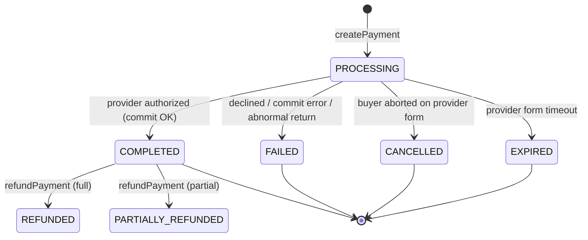
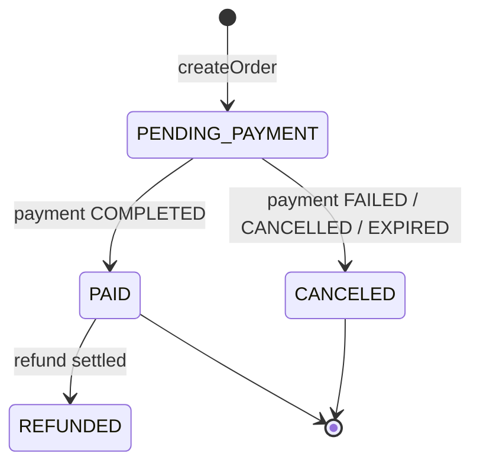

# Payment Flow — end-to-end reference

> Runtime reference for the cart → checkout → payment → confirmation flow across
> **ekoru-web-app**, **ekoru-gateway**, and **ekoru-transactions**.
> For the "what changed / where the files live" changelog, see
> [`CHECKOUT.md`](./CHECKOUT.md). This doc is the **canonical runtime picture**:
> diagrams, payloads, statuses, and how to switch/add providers.
>
> Layer deep-dives:
> - Gateway HTTP edge → [`ekoru-gateway/docs/PAYMENT_FLOW.md`](../../ekoru-gateway/docs/PAYMENT_FLOW.md)
> - Subgraph internals → [`ekoru-transactions/docs/PAYMENT_FLOW.md`](../../ekoru-transactions/docs/PAYMENT_FLOW.md)

---

## 1. Who does what

| Layer | Responsibility | Trusts |
|---|---|---|
| **web-app** | Collects cart + shipping + provider choice. Calls `createOrder`/`createPayment`. Hands the buyer off to the provider. Polls payment status. | Nothing about money — the server owns totals and status. |
| **gateway** | Public HTTP edge. Receives provider return-URLs/webhooks, forwards them to the subgraph's internal mutations, redirects the buyer back. Holds `INTERNAL_SERVICE_SECRET`. | The provider's callback shape; re-checks nothing itself. |
| **transactions** | Source of truth. Owns `Order`/`Payment`, runs the provider adapter (`initiate`/`confirm`), maps provider results → canonical status, flips the Order. | Only the JWT (for the buyer) and the DB. |

**Golden rules**
- The **amount, currency, and receiver are read from the `Order` row**, never from client input. `createPayment` only accepts `orderId`, `provider`, `returnUrl`.
- The **provider's raw callback decides the outcome**, not the token we stored at create-time — otherwise an aborted return would look "normal".
- Order/Payment terminal transitions are **idempotent** (webhook re-delivery is safe).

---

## 2. The happy path (Webpay Plus / Transbank)

```mermaid
sequenceDiagram
    autonumber
    participant B as Buyer (browser)
    participant W as web-app (Next.js)
    participant TX as transactions subgraph
    participant MP as marketplace subgraph
    participant TBK as Transbank (Webpay)
    participant GW as gateway

    Note over B,W: Checkout screen — cart + shipping + provider selected
    B->>W: click "Pay"
    W->>TX: mutation createOrder(input)
    TX->>MP: productsByIds(ids) — canonical prices
    MP-->>TX: [{ id, sellerId, price, isActive }]
    TX-->>W: Order { id, total, currency }  (status=PENDING_PAYMENT)
    W->>TX: mutation createPayment({ orderId, provider: WEBPAY, returnUrl })
    TX->>TX: create Payment (PROCESSING)
    TX->>TBK: tx.create(buyOrder, sessionId, amount, returnUrl)
    TBK-->>TX: { token, url }
    TX-->>W: CreatePaymentResult { paymentId, redirect: WEBPAY_FORM{ url, token } }
    W->>B: auto-submit hidden <form POST> token_ws=token → url
    B->>TBK: pays on Transbank hosted form
    TBK->>W: POST token_ws → /api/checkout/return/webpay
    W->>GW: forward POST /payments/return/webpay
    GW->>TX: mutation processProviderReturn(WEBPAY, {token_ws}, secret)
    TX->>TBK: tx.commit(token_ws)
    TBK-->>TX: { status: AUTHORIZED, response_code: 0 }
    TX->>TX: Payment → COMPLETED, Order → PAID
    TX-->>GW: PaymentStatus = COMPLETED
    GW-->>W: 303 Location /{lang}/cart/confirmation?paymentId=…
    W-->>B: 303 (mirrored) → confirmation page
    loop every 3s until terminal
        B->>TX: query payment(id) { status }
        TX-->>B: { status: COMPLETED }
    end
```



---

## 3. Step-by-step with payloads

### 3.1 `createOrder` — server-owned totals

Web app sends only references + quantities. Totals come back computed.

```graphql
mutation CreateOrder($input: CreateOrderInput!) {
  createOrder(input: $input) { id subtotal shippingCost taxAmount total currency }
}
```
```jsonc
// variables
{
  "input": {
    "items": [{ "productId": 812, "quantity": 1 }],
    "shippingMethod": "DELIVERED_TO_HOME",
    "shippingAddress": {
      "recipientName": "Ana Díaz", "phone": "+56911111111",
      "countryId": 1, "regionId": 13, "cityId": 133, "countyId": 1301,
      "street": "Av. Siempre Viva 742", "reference": "depto 3B", "zipCode": "8320000"
    },
    "currency": "CLP"
  }
}
```
```jsonc
// response
{ "data": { "createOrder": {
  "id": 4021, "subtotal": 19990, "shippingCost": 3990,
  "taxAmount": 0, "total": 23980, "currency": "CLP"
}}}
```
- `shippingAddress` is **required** for `DELIVERED_TO_HOME` and `CARRIER`; omitted for pickups.
- `IN_MID_POINT_PICKUP` is **not payable online** — the UI diverts to chat, and `createOrder` rejects it.
- Shipping cost (v1 flat rates, CLP): `DELIVERED_TO_HOME = 3990`, pickups `0`, `CARRIER` rejected until a live courier quote is wired.
- Order is persisted `PENDING_PAYMENT`.

### 3.2 `createPayment` — synchronous redirect

```graphql
mutation CreatePayment($input: CreatePaymentInput!) {
  createPayment(input: $input) {
    paymentId provider status
    redirect {
      __typename
      ... on WebpayRedirect { kind url token }
      ... on ExternalRedirect { kind url }
    }
    payment {
      id status amount currency orderId
      provider: paymentProvider          # aliased — subgraph field is paymentProvider
      providerTransactionId: externalId  # subgraph field is externalId
      paidAt: processedAt                # subgraph field is processedAt
    }
  }
}
```
```jsonc
// variables — returnUrl points at the Next proxy, which forwards to the gateway
{ "input": {
  "orderId": 4021,
  "provider": "WEBPAY",
  "returnUrl": "https://app.ekoru.cl/api/checkout/return/webpay"
}}
```
```jsonc
// response — Webpay
{ "data": { "createPayment": {
  "paymentId": "7781",
  "provider": "WEBPAY",
  "status": "PROCESSING",
  "redirect": {
    "__typename": "WebpayRedirect",
    "kind": "WEBPAY_FORM",
    "url": "https://webpay3gint.transbank.cl/webpayserver/initTransaction",
    "token": "01ab...e9"
  },
  "payment": { "id": "7781", "status": "PROCESSING", "amount": 23980, "currency": "CLP",
               "orderId": 4021, "provider": "WEBPAY", "providerTransactionId": "ekoru-4021-l1a2b3", "paidAt": null }
}}}
```

Server-side (transactions): loads the Order, asserts `buyerId === payerId` (JWT) and `status === PENDING_PAYMENT`, resolves the seller's active `ChileanPaymentConfig`, writes a `PROCESSING` Payment, then calls the adapter. For Webpay the adapter builds a `buyOrder` (`ekoru-<orderId>-<base36>`, ≤26 chars) and `tx.create(...)`.

### 3.3 Provider hand-off (browser)

The `redirect.kind` discriminator decides how the browser hands off:

| `kind` | Providers | Browser action |
|---|---|---|
| `WEBPAY_FORM` | WEBPAY | Build a hidden `<form method="POST" action={url}>` with one field `name="token_ws"` = `token`, then `form.submit()`. **Webpay rejects GET.** |
| `EXTERNAL` | KHIPU, MERCADOPAGO | `window.location.assign(url)` — a plain GET navigation. |

Implemented in [`features/cart/hooks/useCheckout.ts`](../features/cart/hooks/useCheckout.ts) (`submitWebpayForm`).

### 3.4 Provider return → gateway → commit

After the buyer pays, Transbank **POSTs form-encoded** back to `returnUrl`. The four documented shapes:

| `token_ws` | `TBK_TOKEN` | Meaning | Resulting `PaymentStatus` |
|:-:|:-:|---|---|
| ✓ | — | Normal — buyer finished the form | commit → `COMPLETED` / `FAILED` |
| — | ✓ | Buyer pressed "Anular" on the form | `CANCELLED` |
| — | — | Form timeout (~10 min idle) | `EXPIRED` |
| ✓ | ✓ | Abnormal (double submit) | `FAILED` (never committed) |

The web-app proxy [`app/api/checkout/return/[provider]/route.ts`](../app/api/checkout/return/[provider]/route.ts) forwards the raw body to the gateway `POST /payments/return/webpay`. The gateway calls the subgraph:

```jsonc
// gateway → transactions POST /graphql, header x-internal-secret: <shared>
{
  "query": "mutation ($provider: ChileanPaymentProvider!, $payload: JSON!, $secret: String!) { processProviderReturn(provider: $provider, payload: $payload, internalSecret: $secret) }",
  "variables": {
    "provider": "WEBPAY",
    "payload": { "token_ws": "01ab...e9", "TBK_ORDEN_COMPRA": "ekoru-4021-l1a2b3" },
    "secret": "<INTERNAL_SERVICE_SECRET>"
  }
}
```
```jsonc
// transactions → gateway
{ "data": { "processProviderReturn": "COMPLETED" } }
```

On `COMPLETED` the subgraph sets `Payment.status=COMPLETED`, `processedAt=now()`, and flips the Order to `PAID`. On `FAILED|CANCELLED|EXPIRED` it flips a still-`PENDING_PAYMENT` Order to `CANCELED` (idempotent).

### 3.5 Redirect back + status poll

The gateway replies `303 Location: {WEB_APP_BASE_URL}/{lang}/cart/confirmation?paymentId=7781`; the proxy mirrors it. The confirmation screen polls until terminal:

```graphql
query GetPaymentStatus($paymentId: ID!) {
  payment(id: $paymentId) {
    id status amount currency orderId
    provider: paymentProvider          # aliased to the web-app's Payment field names
    providerTransactionId: externalId
    paidAt: processedAt
  }
}
```
Poll cadence: **every 3s**, stops on a terminal status. See [`features/cart/hooks/usePaymentStatus.ts`](../features/cart/hooks/usePaymentStatus.ts).

---

## 4. Status lifecycles

### Payment



`PaymentStatus` enum: `PENDING · PROCESSING · COMPLETED · FAILED · CANCELLED · REFUNDED · PARTIALLY_REFUNDED · EXPIRED`. Terminal (poll stops): everything except `PENDING`/`PROCESSING`.

### Order



The Order→PAID/CANCELED transition is driven **only** by the subgraph after a provider result (never by the client). `markCanceled` only matches `PENDING_PAYMENT` rows, so late/duplicate failure callbacks can't clobber a paid order.

---

## 5. Provider matrix

| | WEBPAY (Transbank) | KHIPU | MERCADOPAGO |
|---|---|---|---|
| Redirect kind | `WEBPAY_FORM` (POST `token_ws`) | `EXTERNAL` (GET) | `EXTERNAL` (GET) |
| Async webhook? | **No** — return-URL POST is the only signal | Yes (`x-khipu-signature`) | Yes (IPN, `x-signature`) |
| Source of truth | `tx.commit(token_ws)` at return | Webhook | Webhook |
| Return route | `POST /payments/return/webpay` | `GET /payments/return/khipu` | `GET /payments/return/mercadopago` |
| Sandbox creds | Shared Transbank integration code (config creds optional) | Per-seller sandbox token | Per-seller `TEST-` access token |
| Currencies (UI) | CLP | CLP | CLP, ARS, BRL, MXN, USD |

Sandbox test card (Webpay): **4051 8856 0044 6623**, CVV **123**, any future expiry; RUT **11.111.111-1**, password **123**.

---

## 6. Switching & adding providers

### 6.1 How the choice is made at runtime

1. **UI filter** — [`features/cart/constants/paymentProviders.ts`](../features/cart/constants/paymentProviders.ts) `availableProvidersFor(currency)` hides providers whose `currencies[]` don't include the cart currency. (This is why a CLP cart shows Webpay/Khipu/MercadoPago, but a hypothetical ARS cart shows only MercadoPago.)
2. **Seller config** — the seller must have an **active `ChileanPaymentConfig`** row for that provider, else `createPayment` throws `El vendedor no tiene <PROVIDER> configurado`.
3. **Dispatch** — `createPayment(provider)` → `ProviderRegistry.for(provider)` → the matching adapter. No `if/else` in the flow; it's a registry lookup keyed by the enum.
4. **Hand-off** — the adapter's `redirect.kind` tells the browser whether to form-POST or navigate.

**So "switching provider" for an existing, already-coded provider is purely data**: add a `ChileanPaymentConfig` row and let the UI offer it. No deploy needed.

### 6.2 Enabling MercadoPago (already coded, not yet live)

```graphql
mutation {
  createPaymentConfig(input: {
    provider: MERCADOPAGO
    environment: SANDBOX          # picks sandbox_init_point
    secretKey: "TEST-1234..."     # seller's MercadoPago access token
    isActive: true
  }) { id }
}
```
Then, one-time infra:
- `npm i mercadopago` in `ekoru-transactions` (the adapter lazy-loads it; it compiles without it but throws at runtime until installed).
- Ensure `GATEWAY_BASE_URL` is set in `ekoru-transactions` — the adapter builds `notification_url = ${GATEWAY_BASE_URL}/payments/webhook/mercadopago`.
- The webhook (`POST /payments/webhook/mercadopago`) is the source of truth; the GET return just populates the confirmation screen.

No web-app or gateway code change — `MERCADOPAGO` is already in the enum, registry, UI list, and gateway routes.

### 6.3 Adding a brand-new provider (checklist)

1. **Enum** — add the value to `ChileanPaymentProvider` in both the master `prisma/schema.prisma` enum **and** [`ekoru-transactions/src/graphql/enums/index.ts`](../../ekoru-transactions/src/graphql/enums/index.ts); run `node scripts/generate-schemas.js` + `prisma migrate`.
2. **Adapter** — implement `ProviderAdapter` (`initiate` / `confirm` / `handleWebhook`) in `src/payments/providers/`. Lazy-load the SDK.
3. **Registry + module** — add a `case` in `ProviderRegistry.for()` and list the adapter in `payments.module.ts` providers.
4. **ID extraction** — add `case`s to `_extractExternalId` and `_findPaymentForReturn` in `payments.service.ts` so returns/webhooks resolve to the right `Payment`.
5. **Gateway routes** — reuse `GET /payments/return/:provider` if it's a GET return; add a `POST /payments/webhook/:provider` if it webhooks (with signature check).
6. **Web-app** — add a `PAYMENT_PROVIDERS` entry (`id`, `currencies`, `redirectKind`) and a `PaymentProviderId` union member.

Full adapter contract in [`ekoru-transactions/docs/PAYMENT_FLOW.md`](../../ekoru-transactions/docs/PAYMENT_FLOW.md#adapter-contract).

---

## 7. Contract fixes (resolved 2026-07-01)

Two client/subgraph gaps that previously blocked a fully green flow — both now fixed:

1. **`returnUrl` now routes through the gateway.** [`useCheckout.ts`](../features/cart/hooks/useCheckout.ts) sends
   `returnUrl = ${origin}/api/checkout/return/${provider.toLowerCase()}` (was the confirmation
   page, which couldn't commit the payment). The Next proxy forwards to the gateway, which runs
   `tx.commit` and then `303`s back to the confirmation page with `paymentId`. Lowercasing matches
   the gateway routes (`POST /payments/return/webpay`, `GET /payments/return/:provider`).
2. **`Payment` fields aliased to the subgraph schema.** [`fragments.ts`](../graphql/checkout/fragments.ts)
   now queries `provider: paymentProvider`, `providerTransactionId: externalId`, `paidAt: processedAt`.
   The query validates against the subgraph while the response keeps the web-app's `Payment`
   vocabulary — no changes needed to [`types/transaction.ts`](../types/transaction.ts),
   [`types/checkout.ts`](../types/checkout.ts), or the confirmation UI.

---

## 8. Config / secrets recap

Set in each repo's `.env` (see each repo's `CHECKOUT.md` §env). Critical shared values:

| Var | Repos | Why |
|---|---|---|
| `INTERNAL_SERVICE_SECRET` | gateway **and** transactions (identical) | Authenticates gateway → subgraph internal mutations. |
| `EKORU_TRANSACTIONS_{DEV,STAGING,PROD}_URL` | gateway | Where the gateway posts the internal mutations. Prefix chosen by `ENVIRONMENT`. |
| `MARKETPLACE_URL` | transactions | `createOrder` canonical price lookup. |
| `GATEWAY_BASE_URL` | transactions | Builds provider webhook URLs (MercadoPago/Khipu). |
| `WEB_APP_BASE_URL` | gateway | Fallback confirmation-redirect origin when `Referer` is absent. |
